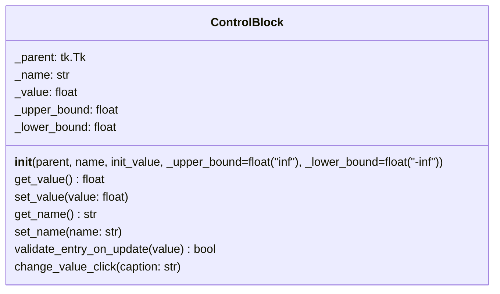

# GUI DESIGN
## Control Block

```mermaid
classDiagram
    class ControlBlock{
        _parent: tk.Tk
        _name: str
        _value: float
        _upper_bound: float
        _lower_bound: float
        __init__(parent, name, init_value, _upper_bound=float("inf"), _lower_bound=float("-inf"))
        get_value() float
        set_value(value: float)
        get_name() str
        set_name(name: str)
        validate_entry_on_update(value) bool
        change_value_click(caption: str)
    }
```